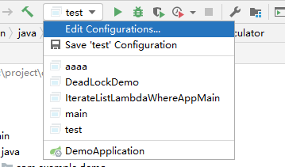
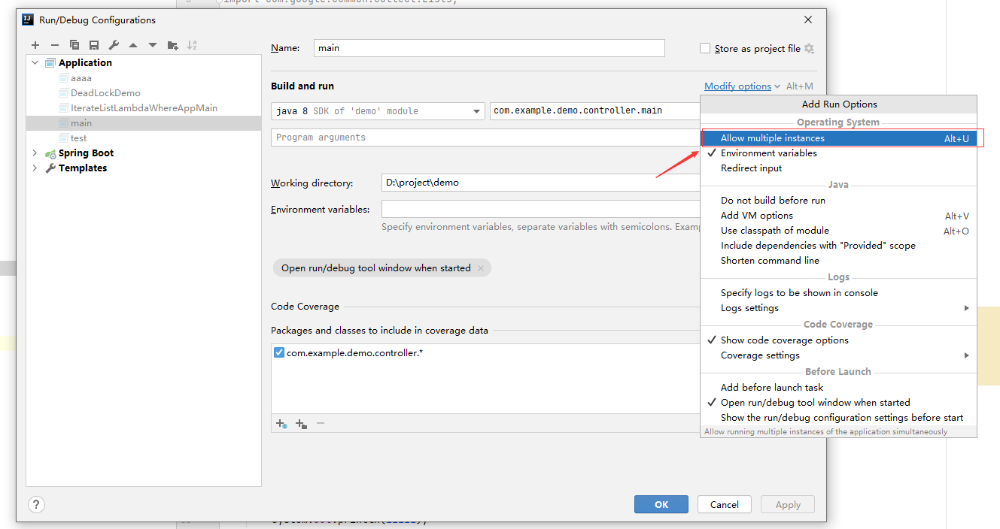

+++
author = "CC"
title = "idea多次启动"
date = "2021-05-08"
description = "最新版 IDEA 多次启动同一个 main 方法"
categories = [
"idea"
]
tags = [
]
image = ""
tableofcontents = true
+++
最新版的idea启动和老版启动不太一样\

然后点击下图按钮\

添加即可多次启动同一个 main 方法