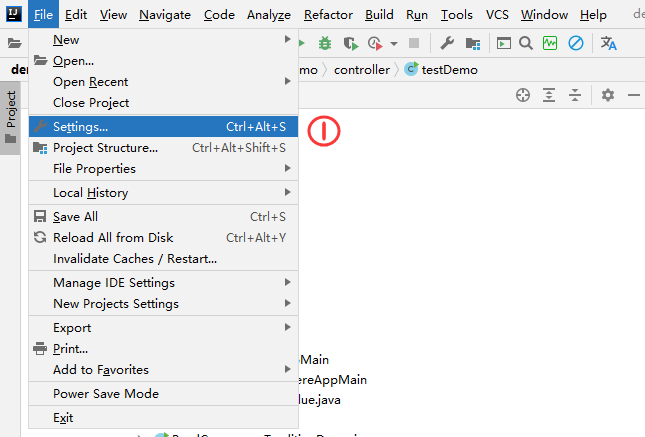
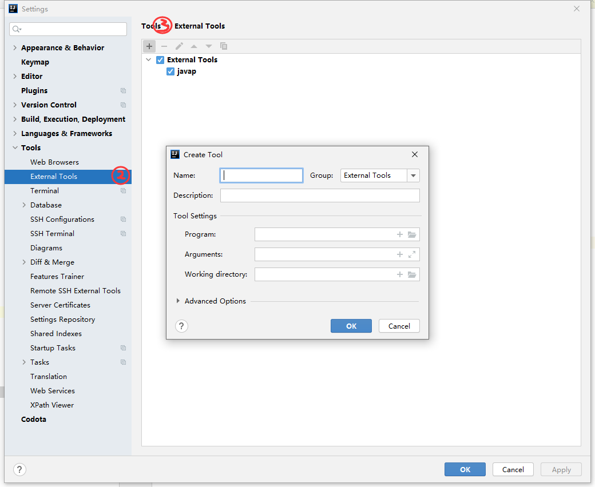
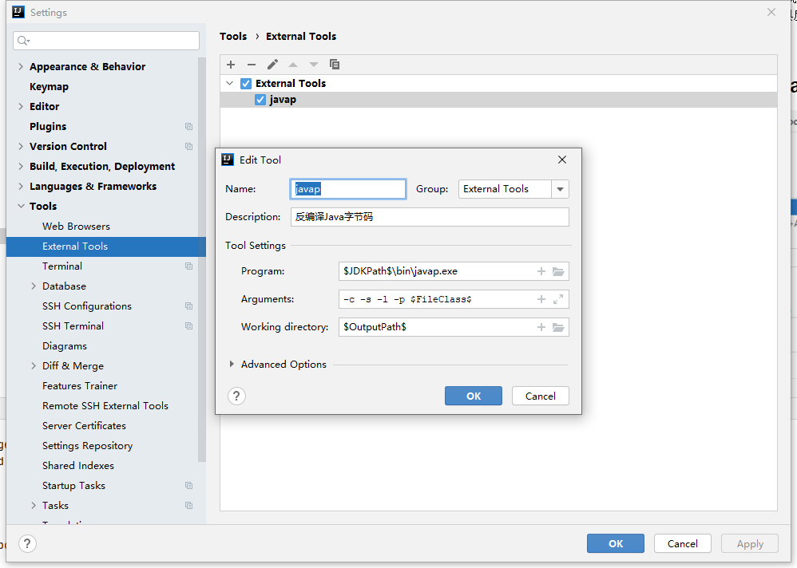
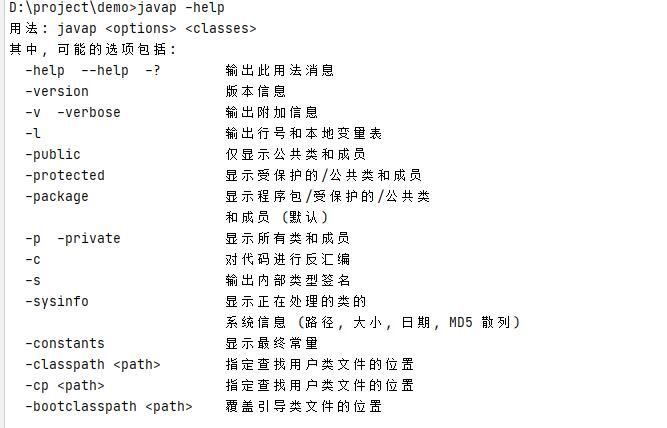

+++
author = "CC"
title = "Idea实现javap工具反编译"
date = "2021-05-17"
description = "intellij idea中使用External Tool实现javap工具反编译"
categories = [
"idea"
]
tags = [
]
image = ""
tableofcontents = false
+++

## 通过Jdk的命令javap可以反编译查看字节码 ##
\
\
按照如下图所示填写相关参数\
\
添加工具，分别设置program，argument等，其中arguments中是javap的参数，具体的参数信息可以去看下help信息

 博客参考来源:\
 &nbsp;&nbsp;[IDEA设置External Tools之Javap反编译字节码](https://www.cnblogs.com/alinainai/p/11723371.html)\
 &nbsp;&nbsp;[intellij idea中使用External Tool实现javap工具反编译](https://www.cnblogs.com/QW-lzm/p/12643399.html)