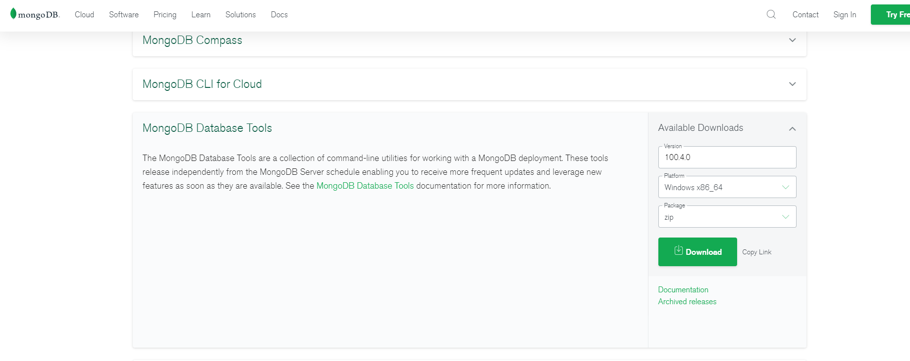

+++
author = "CC"
title = "MongoDB没有mongodump和mongorestore命令"
date = "2021-07-21"
description = ""
categories = [
"MongoDB"
]
tags = [
]
image = ""
tableofcontents = true
+++

## 问题 ##
  Windows 10安装MongoDB后想使用mongodump和mongorestore命令，进行数据的导入和导出，发现在安装的目录下的bin目录，发现bin目录中并没有对应的mongodump和mongorestore。
  
## 原因 ##
  MongoDB4.4版本进行了功能拆分，如需要更多的工具，自行下载
  
## 解决方法 ##
  在[官网自行下载](https://www.mongodb.com/try/download/database-tools)对应的Tools工具,然后解压放到MongoDB的安装目录下面，再配置环境就可以直接在windows下使用mongodump和mongorestore
  

博客参考来源:\
&nbsp;&nbsp;[mongoDB4.4版本没有mongodump和mongorestore命令](https://blog.csdn.net/bidang3275/article/details/115052010)