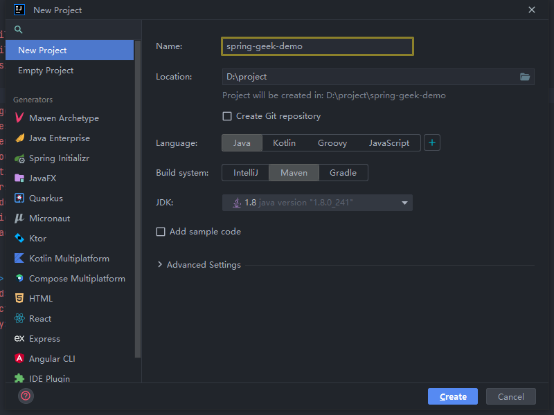

+++
author = "CC"
title = "SpringIoc"
date = "2022-07-02"
description = "SpringIoc依赖注入的三种方式"
categories = [
"Spring",
"Spring Ioc"
]
tags = [
]
image = ""
tableofcontents = true
draft = false
+++

## 新建spring项目 ##
Idea 按如下操作：`File` ->  `New` -> `Project`


1、修改`pom.xml`文件依赖包
```xml
<?xml version="1.0" encoding="UTF-8"?>
<project xmlns="http://maven.apache.org/POM/4.0.0"
         xmlns:xsi="http://www.w3.org/2001/XMLSchema-instance"
         xsi:schemaLocation="http://maven.apache.org/POM/4.0.0 http://maven.apache.org/xsd/maven-4.0.0.xsd">
    <modelVersion>4.0.0</modelVersion>

    <groupId>org.example</groupId>
    <artifactId>spring-geek-demo</artifactId>
    <packaging>pom</packaging>
    <version>1.0-SNAPSHOT</version>
    <modules>
        <module>spring-ioc</module>
    </modules>

    <properties>
        <maven.compiler.source>8</maven.compiler.source>
        <maven.compiler.target>8</maven.compiler.target>
        <spring.version>5.2.2.RELEASE</spring.version>
    </properties>

    <dependencyManagement>
        <dependencies>
            <dependency>
                <groupId>org.springframework</groupId>
                <artifactId>spring-context</artifactId>
                <version>${spring.version}</version>
            </dependency>
        </dependencies>
    </dependencyManagement>

    <dependencies>
        <dependency>
            <groupId>org.springframework</groupId>
            <artifactId>spring-context</artifactId>
        </dependency>
    </dependencies>
</project>
```
2、删除`src`文件夹，新建`Module` -> `spring-ioc`修改**spring-ioc**

