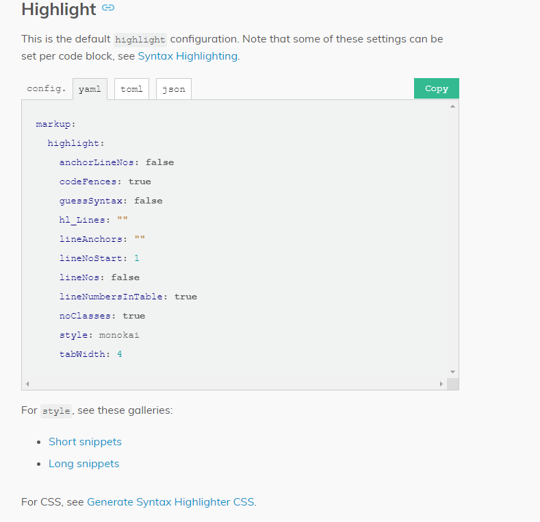
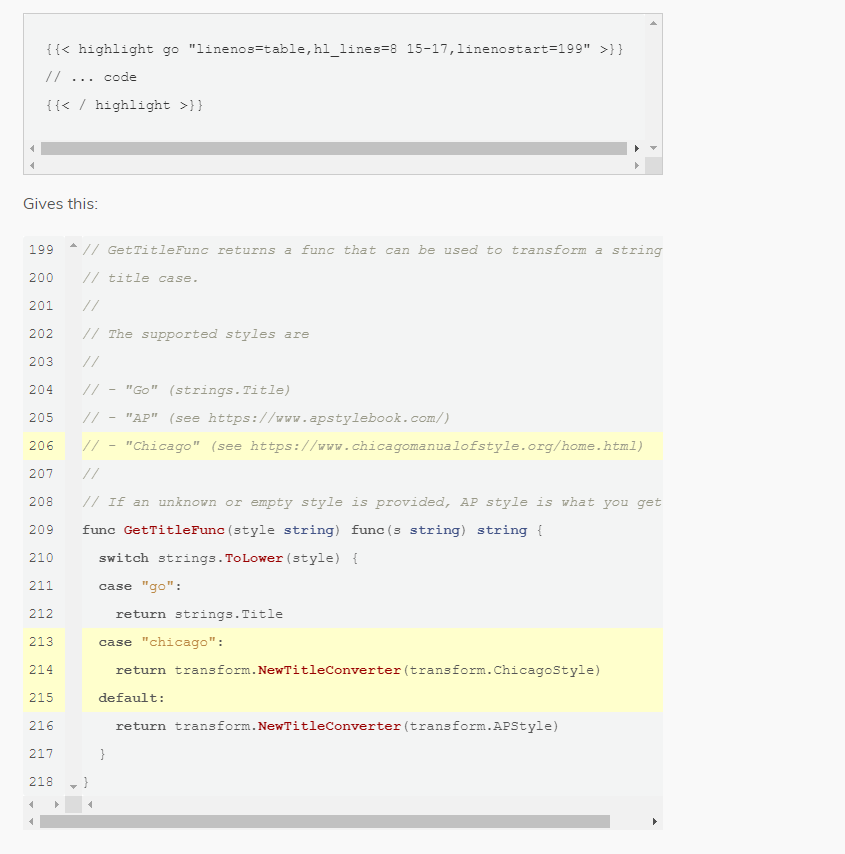

+++
author = "CC"
title = "hugo修改代码块"
date = "2021-05-07"
description = "hugo修改代码块展示"
categories = [
"hugo",
"博客修改"
]
tags = [
]
image = ""
tableofcontents = true
+++
## hugo官网Markdown和其他与标记相关的配置 ##
根据hugo官网中Markdown设置[代码块高亮的配置](https://gohugo.io/getting-started/configuration-markup/#highlight)\
如图：

将其配置拷贝到你的hugo配置中
```yaml
markup:
  highlight:
    anchorLineNos: false
    codeFences: true
    guessSyntax: false
    hl_Lines: ""
    lineAnchors: ""
    lineNoStart: 1   #行从几开始
    lineNos: false   #是否显示行列
    lineNumbersInTable: true
    noClasses: true
    style: monokai   #代码样式
    tabWidth: 4
```
其中代码的样式可以通过[style样式](https://xyproto.github.io/splash/docs/all.html)指定\
如想单独配置某一个代码块，可以按照官网例子如下配置：\


## 添加Cope按钮 ##
**1、定义按钮样式，将cope的css加入到`custom.scss`文件中**：
```css
.highlight-copy-btn {
  position: absolute;
  top: 7px;
  right: 7px;
  border: 0;
  border-radius: 4px;
  padding: 1px;
  font-size: 0.8em;
  line-height: 1.8;
  color: #fff;
  background-color: #777;
  min-width: 55px;
  text-align: center;
}
.highlight-copy-btn:hover {
  background-color: #666;
}
```
**2、将按钮点击后触发的js加入到加入到js文件中**：
我这边是将js加入到`main.ts`文件中
```js
//拷贝代码按钮
var highlightBlocks = document.getElementsByClassName('highlight');
if (highlightBlocks != null) {
    console.info(highlightBlocks);
    Array.prototype.forEach.call(highlightBlocks, addCopyButton);
}
function selectText(node) {
    var selection = window.getSelection();
    var range = document.createRange();
    range.selectNodeContents(node);
    selection.removeAllRanges();
    selection.addRange(range);
    return selection;
}

function flashCopyMessage(el, msg) {
    el.textContent = msg;
    setTimeout(function () {
        el.textContent = "Copy";
    }, 1000);
}

function addCopyButton(containerEl) {
    var copyBtn = document.createElement("button");
    copyBtn.className = "highlight-copy-btn";
    copyBtn.textContent = "Copy";

    var codeEl = containerEl.firstElementChild.firstElementChild.firstElementChild.firstElementChild.children[1];
    copyBtn.addEventListener('click', function () {
        try {
            var selection = selectText(codeEl);
            document.execCommand('copy');
            selection.removeAllRanges();
            flashCopyMessage(copyBtn, 'Copied!')
        } catch (e) {
            console && console.log(e);
            flashCopyMessage(copyBtn, 'Failed :\'(')
        }
    });
    containerEl.appendChild(copyBtn);
}
```
博客参考来源:
[hugo博客自定义代码块](https://tomtomyoung.gitee.io/post/hugo%E5%8D%9A%E5%AE%A2%E8%87%AA%E5%AE%9A%E4%B9%89%E4%BB%A3%E7%A0%81%E5%9D%97/)